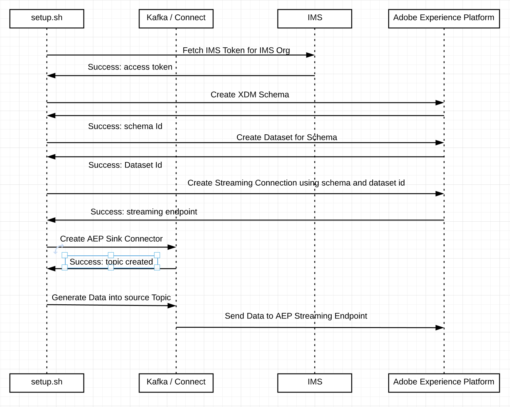

# What is Kafka Connect?

"[Kafka Connect](https://docs.confluent.io/current/connect/index.html)", an open source component of Apache Kafka, is a framework for connecting Kafka with external systems such as databases, key-value stores, search indexes, and file systems.

Kafka Connect is a framework which enables connectors developed by the open source community around Apache Kafka. It allows developers to easily import data from their data sources directly into Kafka, and then take that data from Kafka and then feed it into other systems like Elastic Search.

# Adobe Experience Platform

Adobe Experience Platform weaves all your critical customer data together in real time. This include behavioral, transactional, financial, operational, and third-party data and not just CRM or other first-party data.

Bring in your data, standardize it, make it smarter. See what your customer wants right now and build experiences to match.
 
# Adobe Experience Platform Sink Connector

Adobe Experience Platform Stream connector is based on Kafka Connect. Use this library to stream JSON events from Kafka topics in your datacenter directly into a Adobe Experience Platform in real-time.

#### Architecture

AEP sink connector delivers data from Kafka topics to a registered endpoint of the Adobe Experience Platform.


#### Features

* Seamlessly ingest events from your Kafka topic to Adobe Experience Platform
* Authenticated collection of data using Adobe's Identity Management Service 
* Batching of messages for reduced network calls & higher throughput


### Quick Start

We have included a quick-start script which automates configuration by creating the following artifacts
* Sample XDM (Experience Data Model) schema
* Dataset to collect streamed records
* Data Collection URL
* Kafka topic on your local machine, along with necessary configuration for the AEP Connector

Following figure illustrates steps simulated by setup script.



#### Prerequisite
* Install [Java 8][java-8]
* Install [docker][docker]
* Install [jq][jq-tool]
```bash
brew install jq
```

#### Build Docker and Run
```bash
./gradlew clean build
docker build -t streaming-connect .
docker-compose up -d
```

>> Note: wait for the docker process to start, validate if Kafka connect is running using command below
```bash
curl http://localhost:8083/connectors
[]
```

#### Before you begin

First, you need to get an API Key and IMS Token for accessing Adobe Cloud Platform APIs.
We recommend you start with [this tutorial][tutorial].  There's also a [super helpful blogpost][blogpost] to better
guide you through this process.

#### Running the Quick Start Script to setup AEP resources
```bash
cd scripts
./setup.sh
```
The resulting output should look similar to the one below
```
Enter IMS ORG
<IMS-ORG>
Enter Client ID
***
Enter Client Secret
***
Enter JWT Token
***

Making call to create schema https://platform.adobe.io/ with name Streaming_test_profile_api-20190922211238
Schema ID: https://ns.adobe.com/<tenant>/schemas/090d01896b3cbd72dc7defff1290eb99
Data Set: ["@/dataSets/5d86d1a29ba7e11648cc3afb"]
Streaming Connection: https://dcs.adobedc.net/collection/1e58b84cb62853b333b54980c45bdb40fc3bf80bc47022da0f76eececb2f9237
AEP Sink Connector aep-sink-connector-20190922211238
Enter the number of Experience events to publish
5
Publishing 5 messages for Data set 5d86d1a29ba7e11648cc3afb and schema https://ns.adobe.com/<tenant>/schemas/090d01896b3cbd72dc7defff1290eb99
Published 5 messages
```
The quick-start script will save values for newly created resources like schema and dataset in application.conf making it easier to run test multiple times. Assuming the resources already exist, you have the option of running the data generation script to send data to Adobe Experience Platform. 
```
cd scripts
./generate_data.sh <count>

Example: ./generate_data.sh 500
IMS ORG: XYZ@AdobeOrg
Schema ref: https://ns.adobe.com/<tenant>/schemas/090d01896b3cbd72dc7defff1290eb99
Dataset ID: 5d86d1a29ba7e11648cc3afb
Topic Name: connect-test-20190922211238
Publishing 500 messages for Data set 5d86d1a29ba7e11648cc3afb and schema https://ns.adobe.com/<tenant>/schemas/090d01896b3cbd72dc7defff1290eb99
Published 500 messages
```

> Note: To debug logs you may use following command in different terminal
```bash
docker logs experience-platform-streaming-connect_kafka-connect_1 -f
```

#### Verify Data landing into AEP
To verify your data is landing into platform, login to [AEP][aep] and follow [documentation][monitor-streaming-data-flows] for monitoring your streaming data flows.

### Developer Guide
For running experience-platform-streaming-connect locally step-by-step refer [Developer Guide](./DEVELOPER_GUIDE.md)

[aep]: https://platform.adobe.com
[docker]: https://www.docker.com/
[java-8]: https://www.oracle.com/technetwork/java/javase/downloads/jdk8-downloads-2133151.html
[jq-tool]: https://stedolan.github.io/jq/download/
[monitor-streaming-data-flows]: https://www.adobe.io/apis/experienceplatform/home/data-ingestion/data-ingestion-services.html#!api-specification/markdown/narrative/technical_overview/streaming_ingest/e2e-monitor-streaming-data-flows.md
[blogpost]: https://medium.com/adobetech/using-postman-for-jwt-authentication-on-adobe-i-o-7573428ffe7f
[tutorial]: https://www.adobe.io/apis/experienceplatform/home/tutorials/alltutorials.html#!api-specification/markdown/narrative/tutorials/authenticate_to_acp_tutorial/authenticate_to_acp_tutorial.md
